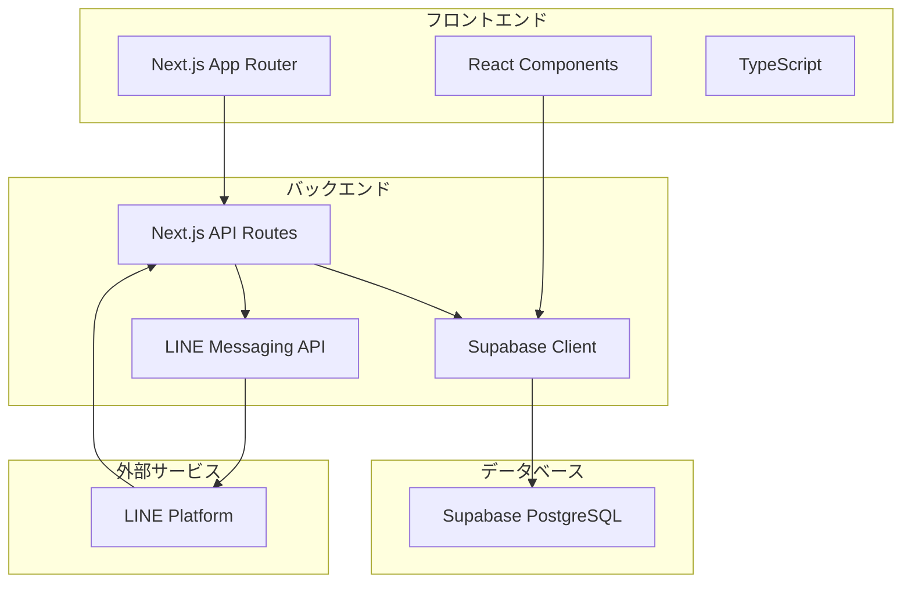

# 商品予約システム - 設計文書

## 概要

LINE連携による商品予約システムの包括的な設計文書です。Next.js + Supabase + LINE Messaging APIを使用し、管理者が複数のフォームを作成・管理し、ユーザーがLINE経由で商品を予約・変更・キャンセルできるシステムを構築します。

## アーキテクチャ

### システム構成図



### 技術スタック

- **フロントエンド**: Next.js 14 (App Router), React, TypeScript, Tailwind CSS
- **バックエンド**: Next.js API Routes, Supabase
- **データベース**: Supabase PostgreSQL
- **外部API**: LINE Messaging API
- **認証**: パスワード認証（管理画面）
- **デプロイ**: Vercel（想定）

## コンポーネントとインターフェース

### 1. データベース設計

#### DB再構築用SQLコード

```sql
-- ===== 既存テーブルの一括削除 =====
-- 外部キー制約があるため、依存関係の逆順で削除

DROP TABLE IF EXISTS reservation_history CASCADE;
DROP TABLE IF EXISTS reservations CASCADE;
DROP TABLE IF EXISTS form_settings CASCADE;
DROP TABLE IF EXISTS preset_products CASCADE;
DROP TABLE IF EXISTS pickup_windows CASCADE;
DROP TABLE IF EXISTS notification_logs CASCADE;
DROP TABLE IF EXISTS admin_users CASCADE;
DROP TABLE IF EXISTS product_presets CASCADE;
DROP TABLE IF EXISTS products CASCADE;

-- ===== 新しいテーブル構造の作成 =====
-- 商品マスタテーブル
CREATE TABLE products (
    id SERIAL PRIMARY KEY,
    product_code TEXT UNIQUE,
    name TEXT NOT NULL,
    variation_id INTEGER DEFAULT 1,
    variation_name TEXT DEFAULT '通常価格',
    tax_type VARCHAR(10) NOT NULL DEFAULT '内税' CHECK (tax_type IN ('内税', '外税')),
    price INTEGER NOT NULL DEFAULT 0,
    barcode TEXT,
    
    -- システム設定
    visible BOOLEAN NOT NULL DEFAULT true,
    display_order INTEGER DEFAULT 0,
    
    -- メタデータ
    created_at TIMESTAMP WITH TIME ZONE NOT NULL DEFAULT NOW(),
    updated_at TIMESTAMP WITH TIME ZONE NOT NULL DEFAULT NOW(),
    
    -- 制約
    CONSTRAINT products_name_check CHECK (length(name) > 0),
    CONSTRAINT products_price_check CHECK (price >= 0)
);

-- プリセット（フォーム）マスタテーブル
CREATE TABLE product_presets (
    id SERIAL PRIMARY KEY,
    preset_name TEXT NOT NULL,
    description TEXT,
    form_expiry_date TIMESTAMP WITH TIME ZONE,
    is_active BOOLEAN NOT NULL DEFAULT true,
    
    -- メタデータ
    created_at TIMESTAMP WITH TIME ZONE NOT NULL DEFAULT NOW(),
    updated_at TIMESTAMP WITH TIME ZONE NOT NULL DEFAULT NOW(),
    
    -- 制約
    CONSTRAINT presets_name_check CHECK (length(preset_name) > 0)
);

-- プリセット商品関連テーブル
CREATE TABLE preset_products (
    id SERIAL PRIMARY KEY,
    preset_id INTEGER NOT NULL REFERENCES product_presets(id) ON DELETE CASCADE,
    product_id INTEGER NOT NULL REFERENCES products(id) ON DELETE CASCADE,
    pickup_start TIMESTAMP WITH TIME ZONE NOT NULL,
    pickup_end TIMESTAMP WITH TIME ZONE NOT NULL,
    display_order INTEGER NOT NULL DEFAULT 0,
    is_active BOOLEAN NOT NULL DEFAULT true,
    
    -- メタデータ
    created_at TIMESTAMP WITH TIME ZONE NOT NULL DEFAULT NOW(),
    updated_at TIMESTAMP WITH TIME ZONE NOT NULL DEFAULT NOW(),
    
    -- 一意制約
    UNIQUE(preset_id, product_id),
    
    -- 制約
    CONSTRAINT preset_products_pickup_dates_check CHECK (pickup_start < pickup_end)
);

-- フォーム設定テーブル
CREATE TABLE form_settings (
    id SERIAL PRIMARY KEY,
    preset_id INTEGER NOT NULL REFERENCES product_presets(id) ON DELETE CASCADE,
    
    -- 表示項目設定
    show_name BOOLEAN NOT NULL DEFAULT true,
    show_furigana BOOLEAN NOT NULL DEFAULT true,
    show_gender BOOLEAN NOT NULL DEFAULT false,
    show_birthday BOOLEAN NOT NULL DEFAULT false,
    show_phone BOOLEAN NOT NULL DEFAULT true,
    show_zip BOOLEAN NOT NULL DEFAULT false,
    show_address1 BOOLEAN NOT NULL DEFAULT false,
    show_address2 BOOLEAN NOT NULL DEFAULT false,
    show_comment BOOLEAN NOT NULL DEFAULT true,
    show_price BOOLEAN NOT NULL DEFAULT true,
    show_total BOOLEAN NOT NULL DEFAULT true,
    
    -- システム設定
    is_enabled BOOLEAN NOT NULL DEFAULT true,
    custom_message TEXT,
    
    -- メタデータ
    created_at TIMESTAMP WITH TIME ZONE NOT NULL DEFAULT NOW(),
    updated_at TIMESTAMP WITH TIME ZONE NOT NULL DEFAULT NOW(),
    
    -- 一意制約
    UNIQUE(preset_id)
);

-- 予約テーブル
CREATE TABLE reservations (
    id UUID PRIMARY KEY DEFAULT gen_random_uuid(),
    preset_id INTEGER NOT NULL REFERENCES product_presets(id) ON DELETE RESTRICT,
    
    -- 顧客情報
    user_name TEXT NOT NULL,
    furigana TEXT,
    gender VARCHAR(10),
    birthday DATE,
    phone_number TEXT NOT NULL,
    zip_code TEXT,
    address1 TEXT,
    address2 TEXT,
    comment TEXT,
    
    -- 予約情報
    selected_products JSONB NOT NULL,
    pickup_date TIMESTAMP WITH TIME ZONE,
    total_amount INTEGER NOT NULL DEFAULT 0,
    
    -- システム情報
    status VARCHAR(20) NOT NULL DEFAULT 'confirmed' CHECK (status IN ('confirmed', 'cancelled', 'completed')),
    line_user_id TEXT,
    cancel_token TEXT UNIQUE,
    
    -- メタデータ
    created_at TIMESTAMP WITH TIME ZONE NOT NULL DEFAULT NOW(),
    updated_at TIMESTAMP WITH TIME ZONE NOT NULL DEFAULT NOW(),
    
    -- 制約
    CONSTRAINT reservations_user_name_check CHECK (length(user_name) > 0),
    CONSTRAINT reservations_phone_check CHECK (length(phone_number) > 0),
    CONSTRAINT reservations_total_check CHECK (total_amount >= 0)
);

-- 予約履歴テーブル
CREATE TABLE reservation_history (
    id UUID PRIMARY KEY,
    preset_id INTEGER,
    
    -- 顧客情報（スナップショット）
    user_name TEXT NOT NULL,
    furigana TEXT,
    gender VARCHAR(10),
    birthday DATE,
    phone_number TEXT NOT NULL,
    zip_code TEXT,
    address1 TEXT,
    address2 TEXT,
    comment TEXT,
    
    -- 予約情報（スナップショット）
    selected_products JSONB NOT NULL,
    pickup_date TIMESTAMP WITH TIME ZONE,
    total_amount INTEGER NOT NULL DEFAULT 0,
    
    -- システム情報
    original_status VARCHAR(20) NOT NULL,
    line_user_id TEXT,
    
    -- 履歴メタデータ
    original_created_at TIMESTAMP WITH TIME ZONE NOT NULL,
    original_updated_at TIMESTAMP WITH TIME ZONE NOT NULL,
    moved_to_history_at TIMESTAMP WITH TIME ZONE NOT NULL DEFAULT NOW()
);

-- 管理者認証テーブル
CREATE TABLE admin_users (
    id SERIAL PRIMARY KEY,
    username TEXT UNIQUE NOT NULL,
    password_hash TEXT NOT NULL,
    is_active BOOLEAN NOT NULL DEFAULT true,
    last_login_at TIMESTAMP WITH TIME ZONE,
    
    -- メタデータ
    created_at TIMESTAMP WITH TIME ZONE NOT NULL DEFAULT NOW(),
    updated_at TIMESTAMP WITH TIME ZONE NOT NULL DEFAULT NOW()
);

-- 通知ログテーブル（既存互換性のため）
CREATE TABLE notification_logs (
    id UUID PRIMARY KEY DEFAULT gen_random_uuid(),
    user_id TEXT NOT NULL,
    type TEXT NOT NULL,
    message JSONB,
    sent_at TIMESTAMP WITH TIME ZONE,
    created_at TIMESTAMP WITH TIME ZONE NOT NULL DEFAULT NOW()
);

-- ===== 初期データの投入 =====

-- デフォルト管理者ユーザー（パスワード: admin123）
INSERT INTO admin_users (username, password_hash) VALUES 
('admin', 'admin123');

-- サンプル商品データ
INSERT INTO products (name, variation_id, variation_name, tax_type, price, display_order) VALUES 
('りんご', 1, '通常価格', '内税', 100, 1),
('りんご', 2, '特価', '内税', 80, 2),
('りんご', 3, '大玉', '内税', 150, 3),
('みかん', 1, '通常価格', '内税', 120, 4),
('みかん', 2, '特価', '内税', 100, 5);

-- サンプルプリセット
INSERT INTO product_presets (preset_name, description) VALUES 
('秋の収穫祭', '秋の新鮮な果物をお届けします'),
('特価セール', 'お得な価格でご提供中');

-- サンプルフォーム設定
INSERT INTO form_settings (preset_id, show_name, show_furigana, show_phone, show_comment, show_price, show_total) VALUES 
(1, true, true, true, true, true, true),
(2, true, false, true, false, true, true);

-- サンプルプリセット商品関連
INSERT INTO preset_products (preset_id, product_id, pickup_start, pickup_end, display_order) VALUES 
(1, 1, '2025-02-01 09:00:00+09', '2025-02-28 17:00:00+09', 1),
(1, 2, '2025-02-01 09:00:00+09', '2025-02-28 17:00:00+09', 2),
(1, 4, '2025-02-01 09:00:00+09', '2025-02-28 17:00:00+09', 3),
(2, 2, '2025-02-15 09:00:00+09', '2025-03-15 17:00:00+09', 1),
(2, 5, '2025-02-15 09:00:00+09', '2025-03-15 17:00:00+09', 2);
```

#### インデックス設計

```sql
-- パフォーマンス最適化用インデックス
CREATE INDEX idx_products_visible_order ON products(visible, display_order) WHERE visible = true;
CREATE INDEX idx_products_variation ON products(name, variation_id) WHERE visible = true;

CREATE INDEX idx_presets_active ON product_presets(is_active, form_expiry_date) WHERE is_active = true;

CREATE INDEX idx_preset_products_preset ON preset_products(preset_id, display_order) WHERE is_active = true;
CREATE INDEX idx_preset_products_pickup ON preset_products(pickup_start, pickup_end) WHERE is_active = true;

CREATE INDEX idx_form_settings_enabled ON form_settings(preset_id) WHERE is_enabled = true;

CREATE INDEX idx_reservations_preset_status ON reservations(preset_id, status, created_at);
CREATE INDEX idx_reservations_phone ON reservations(phone_number, created_at);
CREATE INDEX idx_reservations_cancel_token ON reservations(cancel_token) WHERE cancel_token IS NOT NULL;

CREATE INDEX idx_reservation_history_preset ON reservation_history(preset_id, moved_to_history_at);
CREATE INDEX idx_reservation_history_phone ON reservation_history(phone_number, moved_to_history_at);
```

### 2. API設計

#### RESTful API エンドポイント

```typescript
// フォーム設定取得
GET /api/presets/{presetId}/config
Response: {
  preset: ProductPreset,
  form_settings: FormSettings,
  products: Product[],
  pickup_schedules: PickupSchedule[]
}

// 予約作成

POST /api/reservations
Request: {
  preset_id: number,
  user_data: UserData,
  selected_products: SelectedProduct[],
  pickup_date: string
}
Response: {
  reservation_id: string,
  cancel_url: string
}

// 予約詳細取得（キャンセル用）
GET /api/reservations/{reservationId}/cancel?phone={phoneNumber}
Response: {
  reservation: Reservation,
  editable_fields: string[]
}

// 予約更新
PUT /api/reservations/{reservationId}
Request: {
  phone_number: string,
  updates: Partial<ReservationData>
}

// 予約キャンセル
DELETE /api/reservations/{reservationId}
Request: {
  phone_number: string
}

// 管理画面 - 予約一覧
GET /api/admin/reservations?preset_id={presetId}&status={status}
Response: {
  reservations: Reservation[],
  total: number,
  page: number
}

// 管理画面 - 予約ステータス更新
PUT /api/admin/reservations/{reservationId}/status
Request: {
  status: 'confirmed' | 'completed' | 'cancelled'
}

// 商品CSV一括登録
POST /api/admin/products/bulk-import
Request: FormData (CSV file)
Response: {
  imported: number,
  errors: ImportError[]
}
```

### 3. フロントエンド設計

#### コンポーネント構造

```
src/
├── app/
│   ├── form/[presetId]/
│   │   ├── page.tsx              # 入力画面
│   │   ├── confirm/page.tsx      # 確認画面
│   │   └── complete/page.tsx     # 完了画面
│   ├── cancel/[reservationId]/
│   │   ├── page.tsx              # 電話番号確認画面
│   │   └── edit/page.tsx         # キャンセル変更画面
│   ├── admin/
│   │   ├── login/page.tsx        # 管理者ログイン
│   │   ├── dashboard/page.tsx    # ダッシュボード
│   │   ├── presets/page.tsx      # フォーム管理
│   │   ├── products/page.tsx     # 商品管理
│   │   └── reservations/page.tsx # 予約管理
│   └── api/                      # API Routes
├── components/
│   ├── forms/
│   │   ├── ReservationForm.tsx   # 予約フォーム
│   │   ├── ProductSelector.tsx   # 商品選択
│   │   └── DatePicker.tsx        # 日付選択
│   ├── admin/
│   │   ├── PresetManager.tsx     # フォーム管理
│   │   ├── ProductManager.tsx    # 商品管理
│   │   └── ReservationList.tsx   # 予約一覧
│   └── common/
│       ├── Layout.tsx            # 共通レイアウト
│       └── ErrorBoundary.tsx     # エラーハンドリング
└── lib/
    ├── supabase.ts               # DB接続
    ├── line-messaging.ts         # LINE API
    └── validations/              # バリデーション
```

#### 状態管理

```typescript
// Zustand を使用した状態管理
interface ReservationStore {
  // フォーム状態
  formData: ReservationFormData;
  selectedProducts: SelectedProduct[];
  currentStep: 'input' | 'confirm' | 'complete';
  
  // アクション
  updateFormData: (data: Partial<ReservationFormData>) => void;
  addProduct: (product: SelectedProduct) => void;
  removeProduct: (productId: number) => void;
  nextStep: () => void;
  resetForm: () => void;
}

interface AdminStore {
  // 管理画面状態
  currentPreset: ProductPreset | null;
  reservations: Reservation[];
  products: Product[];
  
  // アクション
  setCurrentPreset: (preset: ProductPreset) => void;
  loadReservations: (presetId: number) => Promise<void>;
  updateReservationStatus: (id: string, status: string) => Promise<void>;
}
```

## データモデル

### TypeScript型定義

```typescript
// 商品関連
export interface Product {
  readonly id: number;
  readonly product_code?: string;
  readonly name: string;
  readonly variation_id: number;
  readonly variation_name: string;
  readonly tax_type: '内税' | '外税';
  readonly price: number;
  readonly barcode?: string;
  readonly visible: boolean;
  readonly display_order: number;
  readonly created_at: string;
  readonly updated_at: string;
}

// プリセット関連
export interface ProductPreset {
  readonly id: number;
  readonly preset_name: string;
  readonly description?: string;
  readonly form_expiry_date?: string;
  readonly is_active: boolean;
  readonly created_at: string;
  readonly updated_at: string;
}

export interface PresetProduct {
  readonly id: number;
  readonly preset_id: number;
  readonly product_id: number;
  readonly pickup_start: string;
  readonly pickup_end: string;
  readonly display_order: number;
  readonly is_active: boolean;
  readonly created_at: string;
  readonly updated_at: string;
  readonly product?: Product;
}

// フォーム設定
export interface FormSettings {
  readonly id: number;
  readonly preset_id: number;
  readonly show_name: boolean;
  readonly show_furigana: boolean;
  readonly show_gender: boolean;
  readonly show_birthday: boolean;
  readonly show_phone: boolean;
  readonly show_zip: boolean;
  readonly show_address1: boolean;
  readonly show_address2: boolean;
  readonly show_comment: boolean;
  readonly show_price: boolean;
  readonly show_total: boolean;
  readonly is_enabled: boolean;
  readonly custom_message?: string;
  readonly created_at: string;
  readonly updated_at: string;
}

// 予約関連
export interface Reservation {
  readonly id: string;
  readonly preset_id: number;
  readonly user_name: string;
  readonly furigana?: string;
  readonly gender?: string;
  readonly birthday?: string;
  readonly phone_number: string;
  readonly zip_code?: string;
  readonly address1?: string;
  readonly address2?: string;
  readonly comment?: string;
  readonly selected_products: SelectedProduct[];
  readonly pickup_date?: string;
  readonly total_amount: number;
  readonly status: 'confirmed' | 'cancelled' | 'completed';
  readonly line_user_id?: string;
  readonly cancel_token?: string;
  readonly created_at: string;
  readonly updated_at: string;
}

export interface SelectedProduct {
  readonly product_id: number;
  readonly product_name: string;
  readonly variation_name: string;
  readonly quantity: number;
  readonly unit_price: number;
  readonly total_price: number;
  readonly tax_type: '内税' | '外税';
}
```

## エラーハンドリング

### エラー分類と対応

```typescript
// カスタムエラークラス
export class ValidationError extends Error {
  constructor(message: string, public field?: string) {
    super(message);
    this.name = 'ValidationError';
  }
}

export class NotFoundError extends Error {
  constructor(resource: string, id: string | number) {
    super(`${resource} not found: ${id}`);
    this.name = 'NotFoundError';
  }
}

export class AuthenticationError extends Error {
  constructor(message: string = 'Authentication failed') {
    super(message);
    this.name = 'AuthenticationError';
  }
}

export class LineApiError extends Error {
  constructor(message: string, public statusCode?: number) {
    super(message);
    this.name = 'LineApiError';
  }
}

// エラーハンドラー
export function handleApiError(error: unknown): NextResponse {
  console.error('API Error:', error);

  if (error instanceof ValidationError) {
    return NextResponse.json(
      { error: error.message, field: error.field },
      { status: 400 }
    );
  }

  if (error instanceof NotFoundError) {
    return NextResponse.json(
      { error: error.message },
      { status: 404 }
    );
  }

  if (error instanceof AuthenticationError) {
    return NextResponse.json(
      { error: error.message },
      { status: 401 }
    );
  }

  if (error instanceof LineApiError) {
    return NextResponse.json(
      { error: 'LINE通知の送信に失敗しました', details: error.message },
      { status: 500 }
    );
  }

  return NextResponse.json(
    { error: 'Internal server error' },
    { status: 500 }
  );
}
```

## テスト戦略

### テスト構成

```typescript
// 単体テスト（Jest + Testing Library）
describe('ReservationForm', () => {
  it('should validate required fields', () => {
    // フォームバリデーションのテスト
  });

  it('should calculate total amount correctly', () => {
    // 金額計算のテスト
  });
});

// 統合テスト（API Routes）
describe('/api/reservations', () => {
  it('should create reservation successfully', async () => {
    // 予約作成APIのテスト
  });

  it('should handle validation errors', async () => {
    // バリデーションエラーのテスト
  });
});

// E2Eテスト（Playwright）
test('complete reservation flow', async ({ page }) => {
  // 予約完了までの一連の流れをテスト
  await page.goto('/form/1');
  await page.fill('[name="user_name"]', 'テストユーザー');
  // ... 続く
});
```

### テストデータ管理

```typescript
// テスト用ファクトリー
export const createTestProduct = (overrides?: Partial<Product>): Product => ({
  id: 1,
  name: 'テスト商品',
  variation_id: 1,
  variation_name: '通常価格',
  tax_type: '内税',
  price: 1000,
  visible: true,
  display_order: 0,
  created_at: new Date().toISOString(),
  updated_at: new Date().toISOString(),
  ...overrides,
});

export const createTestReservation = (overrides?: Partial<Reservation>): Reservation => ({
  id: 'test-reservation-id',
  preset_id: 1,
  user_name: 'テストユーザー',
  phone_number: '090-1234-5678',
  selected_products: [
    {
      product_id: 1,
      product_name: 'テスト商品',
      variation_name: '通常価格',
      quantity: 1,
      unit_price: 1000,
      total_price: 1000,
      tax_type: '内税',
    },
  ],
  total_amount: 1000,
  status: 'confirmed',
  created_at: new Date().toISOString(),
  updated_at: new Date().toISOString(),
  ...overrides,
});
```

## セキュリティ考慮事項

### データ保護

1. **個人情報の暗号化**: 電話番号、住所等の機密情報は暗号化して保存
2. **アクセス制御**: 管理画面は認証必須、予約データは電話番号認証
3. **入力値検証**: すべての入力値に対する厳密なバリデーション
4. **SQLインジェクション対策**: Supabaseのパラメータ化クエリを使用

### API セキュリティ

```typescript
// レート制限
export const rateLimiter = rateLimit({
  windowMs: 15 * 60 * 1000, // 15分
  max: 100, // 最大100リクエスト
  message: 'Too many requests',
});

// CORS設定
export const corsOptions = {
  origin: process.env.ALLOWED_ORIGINS?.split(',') || ['http://localhost:3000'],
  methods: ['GET', 'POST', 'PUT', 'DELETE'],
  allowedHeaders: ['Content-Type', 'Authorization'],
};

// 入力値サニタイゼーション
export const sanitizeInput = (input: string): string => {
  return input.trim().replace(/<script\b[^<]*(?:(?!<\/script>)<[^<]*)*<\/script>/gi, '');
};
```

## パフォーマンス最適化

### データベース最適化

1. **適切なインデックス**: 検索頻度の高いカラムにインデックス設定
2. **クエリ最適化**: N+1問題の回避、必要なデータのみ取得
3. **接続プール**: Supabaseの接続プール機能を活用

### フロントエンド最適化

```typescript
// 遅延読み込み
const ProductSelector = lazy(() => import('./ProductSelector'));
const AdminDashboard = lazy(() => import('./AdminDashboard'));

// メモ化
const MemoizedProductList = memo(ProductList);

// 仮想化（大量データ対応）
import { FixedSizeList as List } from 'react-window';

const VirtualizedReservationList = ({ reservations }) => (
  <List
    height={600}
    itemCount={reservations.length}
    itemSize={80}
    itemData={reservations}
  >
    {ReservationItem}
  </List>
);
```

## 運用・監視

### ログ設計

```typescript
// 構造化ログ
export const logger = {
  info: (message: string, meta?: object) => {
    console.log(JSON.stringify({
      level: 'info',
      message,
      timestamp: new Date().toISOString(),
      ...meta,
    }));
  },
  
  error: (message: string, error?: Error, meta?: object) => {
    console.error(JSON.stringify({
      level: 'error',
      message,
      error: error?.message,
      stack: error?.stack,
      timestamp: new Date().toISOString(),
      ...meta,
    }));
  },
};

// 使用例
logger.info('Reservation created', { 
  reservationId: reservation.id,
  presetId: reservation.preset_id,
  userId: reservation.line_user_id 
});
```

### ヘルスチェック

```typescript
// /api/health エンドポイント
export async function GET() {
  try {
    // データベース接続確認
    const { data, error } = await supabase
      .from('products')
      .select('count')
      .limit(1);

    if (error) throw error;

    // LINE API接続確認（オプション）
    // const lineStatus = await checkLineApiStatus();

    return NextResponse.json({
      status: 'healthy',
      timestamp: new Date().toISOString(),
      services: {
        database: 'healthy',
        // lineApi: lineStatus,
      },
    });
  } catch (error) {
    return NextResponse.json(
      {
        status: 'unhealthy',
        timestamp: new Date().toISOString(),
        error: error.message,
      },
      { status: 500 }
    );
  }
}
```

この設計文書は、要件文書で定義された機能を技術的に実現するための包括的な設計を提供しています。現在の実装状況を考慮し、段階的な改善が可能な構造となっています。