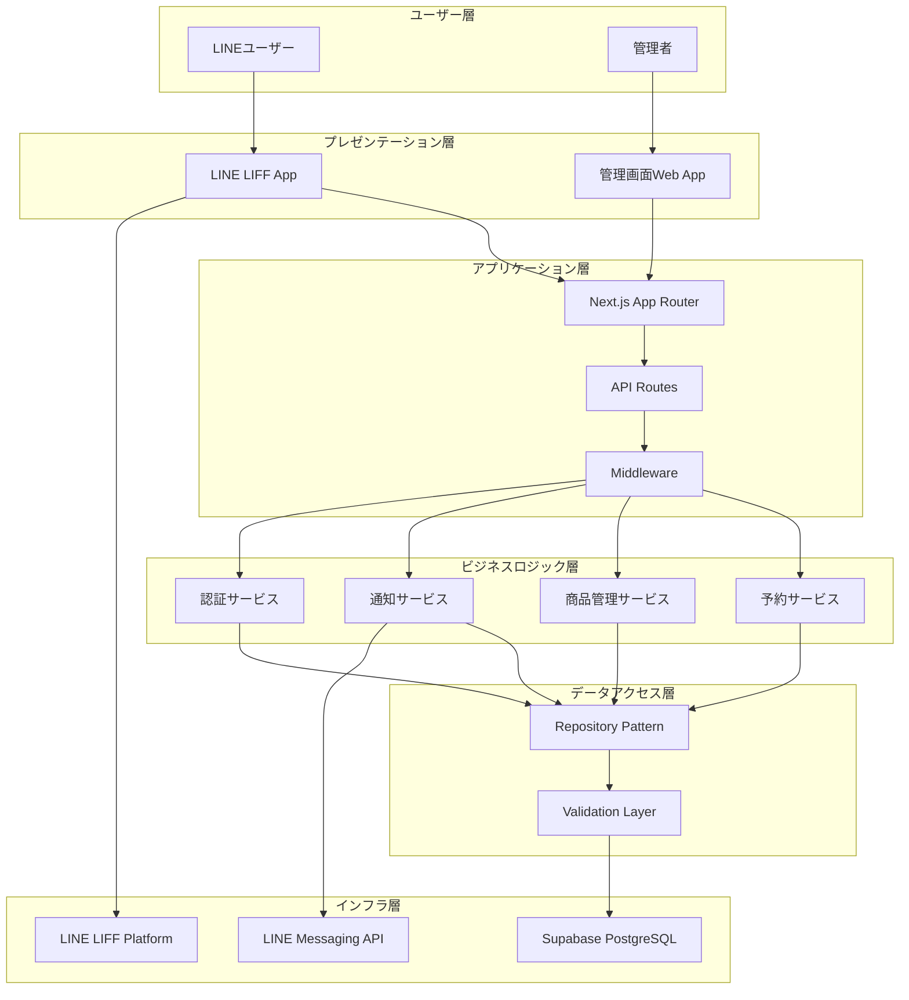
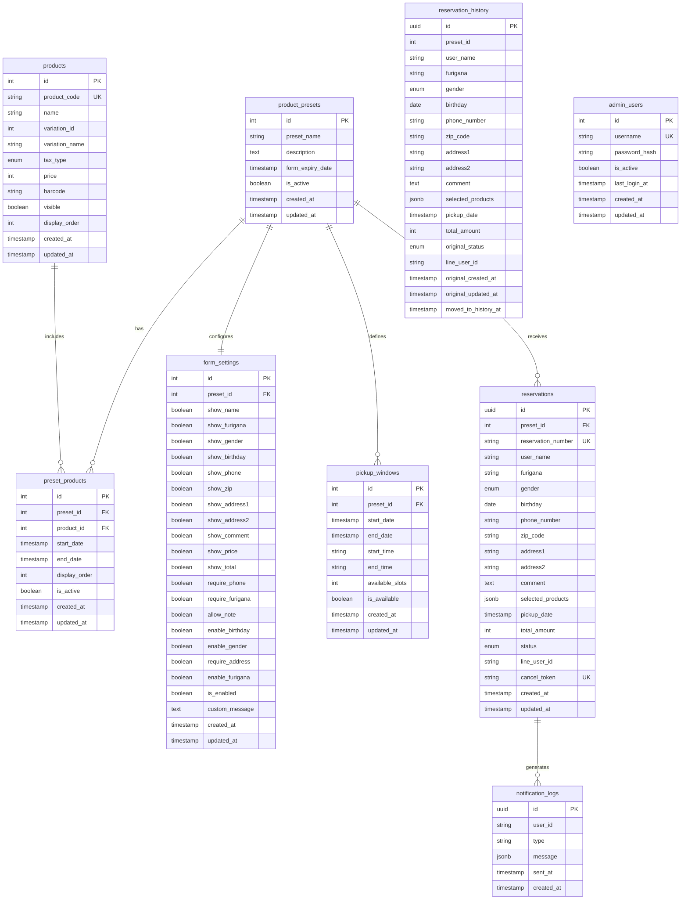
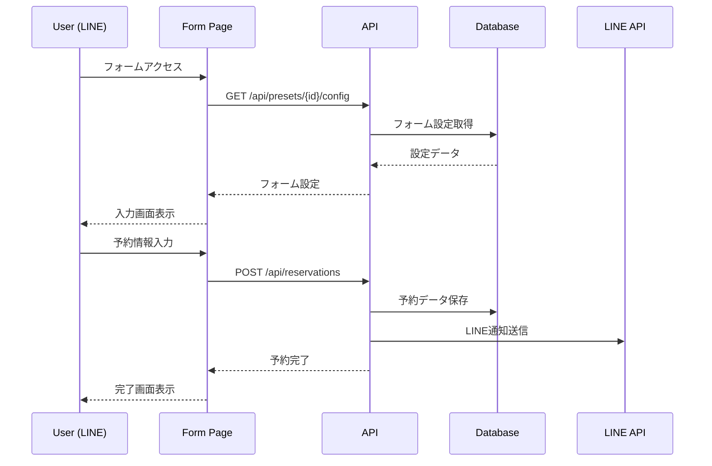
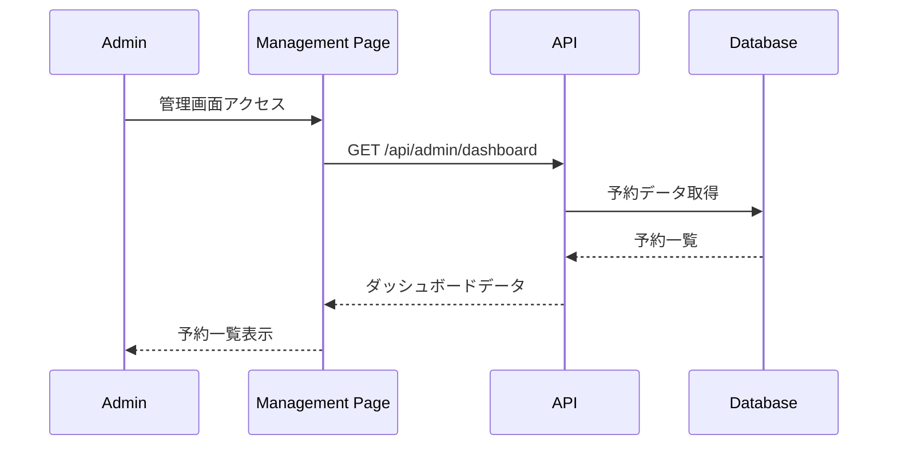

# 商品予約システム完全仕様書 - 20250829版

## 📋 **システム概要**

LINE連携による商品予約システムの完全仕様書です。この文書は設計・実装・運用のすべてを網羅し、開発者が参照すべき唯一の情報源として機能します。

**作成日**: 2025年8月29日  
**バージョン**: 1.0.0  
**対象**: 完全実装仕様（設計・開発・運用・保守）

### **システムの目的**
- 管理者が複数のフォームを効率的に作成・管理
- ユーザーがLINE経由で直感的に商品予約
- 予約の変更・キャンセル機能
- 包括的な管理機能とレポート機能

## 🎯 **段階的リリース計画**

### **Phase 1: 基本機能（最優先）**
- ✅ 基本的な予約フォーム機能
- ✅ 管理画面（ダッシュボード、商品管理）
- ⚠️ **緊急修正**: `totalItems`エラーの解決
- 🔧 LIFF機能の適切な分離

### **Phase 2: 予約管理機能**
- 予約変更・キャンセル機能
- LINE通知機能の強化
- 予約履歴管理

### **Phase 3: 高度な管理機能**
- 詳細な予約管理画面
- CSV一括登録機能
- レポート・分析機能

## 🏗️ **アーキテクチャ設計**

### **システム構成図**



### **レイヤー別責務**

#### **1. プレゼンテーション層**
- **LINE LIFF App**: ユーザー向け予約インターフェース
- **管理画面Web App**: 管理者向け管理インターフェース

#### **2. アプリケーション層**
- **Next.js App Router**: ルーティングとページレンダリング
- **API Routes**: RESTful API エンドポイント
- **Middleware**: 認証・認可・ログ・エラーハンドリング

#### **3. ビジネスロジック層**
- **予約サービス**: 予約作成・変更・キャンセル
- **商品管理サービス**: 商品CRUD・CSV処理
- **通知サービス**: LINE通知・メール通知
- **認証サービス**: 管理者認証・セッション管理

#### **4. データアクセス層**
- **Repository Pattern**: データアクセスの抽象化
- **Validation Layer**: 入力値検証・データ整合性

#### **5. インフラ層**
- **Supabase PostgreSQL**: メインデータベース
- **LINE Messaging API**: 通知送信
- **LINE LIFF Platform**: LINE内ブラウザ

## 🗄️ **データベース設計**

### **完全ER図**



### **テーブル詳細仕様**

#### **products（商品マスタ）**
```sql
CREATE TABLE products (
    id SERIAL PRIMARY KEY,
    product_code TEXT UNIQUE,                    -- 商品コード（任意）
    name TEXT NOT NULL,                          -- 商品名
    variation_id INTEGER DEFAULT 1,              -- バリエーションID
    variation_name TEXT DEFAULT '通常価格',       -- バリエーション名
    tax_type VARCHAR(10) NOT NULL DEFAULT '内税' CHECK (tax_type IN ('内税', '外税')),
    price INTEGER NOT NULL DEFAULT 0,            -- 価格（円）
    barcode TEXT,                                -- バーコード（任意）
    visible BOOLEAN NOT NULL DEFAULT true,       -- 表示フラグ
    display_order INTEGER DEFAULT 0,             -- 表示順
    created_at TIMESTAMP WITH TIME ZONE NOT NULL DEFAULT NOW(),
    updated_at TIMESTAMP WITH TIME ZONE NOT NULL DEFAULT NOW(),
    
    -- 制約
    CONSTRAINT products_name_check CHECK (length(name) > 0),
    CONSTRAINT products_price_check CHECK (price >= 0),
    CONSTRAINT products_display_order_check CHECK (display_order >= 0)
);

-- インデックス
CREATE INDEX idx_products_visible_order ON products(visible, display_order) WHERE visible = true;
CREATE INDEX idx_products_name_search ON products USING gin(to_tsvector('japanese', name));
CREATE INDEX idx_products_variation ON products(name, variation_id);
```

#### **product_presets（フォーム設定）**
```sql
CREATE TABLE product_presets (
    id SERIAL PRIMARY KEY,
    preset_name TEXT NOT NULL,                   -- フォーム名
    description TEXT,                            -- 説明
    form_expiry_date TIMESTAMP WITH TIME ZONE,   -- フォーム有効期限
    is_active BOOLEAN NOT NULL DEFAULT true,     -- 有効フラグ
    created_at TIMESTAMP WITH TIME ZONE NOT NULL DEFAULT NOW(),
    updated_at TIMESTAMP WITH TIME ZONE NOT NULL DEFAULT NOW(),
    
    -- 制約
    CONSTRAINT presets_name_check CHECK (length(preset_name) > 0)
);

-- インデックス
CREATE INDEX idx_presets_active ON product_presets(is_active, form_expiry_date) WHERE is_active = true;
```

#### **preset_products（プリセット商品関連）**
```sql
CREATE TABLE preset_products (
    id SERIAL PRIMARY KEY,
    preset_id INTEGER NOT NULL REFERENCES product_presets(id) ON DELETE CASCADE,
    product_id INTEGER NOT NULL REFERENCES products(id) ON DELETE CASCADE,
    start_date TIMESTAMP WITH TIME ZONE NOT NULL, -- 引き取り開始日
    end_date TIMESTAMP WITH TIME ZONE NOT NULL,   -- 引き取り終了日
    display_order INTEGER NOT NULL DEFAULT 0,     -- 表示順
    is_active BOOLEAN NOT NULL DEFAULT true,       -- 有効フラグ
    created_at TIMESTAMP WITH TIME ZONE NOT NULL DEFAULT NOW(),
    updated_at TIMESTAMP WITH TIME ZONE NOT NULL DEFAULT NOW(),
    
    -- 制約
    UNIQUE(preset_id, product_id),
    CONSTRAINT preset_products_dates_check CHECK (start_date < end_date),
    CONSTRAINT preset_products_display_order_check CHECK (display_order >= 0)
);

-- インデックス
CREATE INDEX idx_preset_products_preset ON preset_products(preset_id, display_order) WHERE is_active = true;
CREATE INDEX idx_preset_products_dates ON preset_products(start_date, end_date) WHERE is_active = true;
```

#### **form_settings（フォーム表示設定）**
```sql
CREATE TABLE form_settings (
    id SERIAL PRIMARY KEY,
    preset_id INTEGER NOT NULL REFERENCES product_presets(id) ON DELETE CASCADE,
    
    -- 新しい表示項目設定
    show_name BOOLEAN NOT NULL DEFAULT true,
    show_furigana BOOLEAN NOT NULL DEFAULT true,
    show_gender BOOLEAN NOT NULL DEFAULT false,
    show_birthday BOOLEAN NOT NULL DEFAULT false,
    show_phone BOOLEAN NOT NULL DEFAULT true,
    show_zip BOOLEAN NOT NULL DEFAULT false,
    show_address1 BOOLEAN NOT NULL DEFAULT false,
    show_address2 BOOLEAN NOT NULL DEFAULT false,
    show_comment BOOLEAN NOT NULL DEFAULT true,
    show_price BOOLEAN NOT NULL DEFAULT true,
    show_total BOOLEAN NOT NULL DEFAULT true,
    
    -- 互換性フィールド（既存コードとの互換性維持）
    require_phone BOOLEAN NOT NULL DEFAULT true,
    require_furigana BOOLEAN NOT NULL DEFAULT false,
    allow_note BOOLEAN NOT NULL DEFAULT true,
    enable_birthday BOOLEAN NOT NULL DEFAULT false,
    enable_gender BOOLEAN NOT NULL DEFAULT false,
    require_address BOOLEAN NOT NULL DEFAULT false,
    enable_furigana BOOLEAN NOT NULL DEFAULT true,
    
    -- システム設定
    is_enabled BOOLEAN NOT NULL DEFAULT true,
    custom_message TEXT,
    
    created_at TIMESTAMP WITH TIME ZONE NOT NULL DEFAULT NOW(),
    updated_at TIMESTAMP WITH TIME ZONE NOT NULL DEFAULT NOW(),
    
    -- 制約
    UNIQUE(preset_id)
);

-- インデックス
CREATE INDEX idx_form_settings_enabled ON form_settings(preset_id) WHERE is_enabled = true;
```

#### **reservations（予約データ）**
```sql
CREATE TABLE reservations (
    id UUID PRIMARY KEY DEFAULT gen_random_uuid(),
    preset_id INTEGER NOT NULL REFERENCES product_presets(id) ON DELETE RESTRICT,
    reservation_number TEXT UNIQUE NOT NULL DEFAULT ('R' || to_char(NOW(), 'YYYYMMDD') || '-' || LPAD(nextval('reservation_seq')::text, 4, '0')),
    
    -- 顧客情報
    user_name TEXT NOT NULL,
    furigana TEXT,
    gender VARCHAR(10) CHECK (gender IN ('男性', '女性', 'その他')),
    birthday DATE,
    phone_number TEXT NOT NULL,
    zip_code TEXT,
    address1 TEXT,
    address2 TEXT,
    comment TEXT,
    
    -- 予約情報
    selected_products JSONB NOT NULL,
    pickup_date TIMESTAMP WITH TIME ZONE,
    total_amount INTEGER NOT NULL DEFAULT 0,
    
    -- システム情報
    status VARCHAR(20) NOT NULL DEFAULT 'confirmed' CHECK (status IN ('pending', 'confirmed', 'cancelled', 'completed')),
    line_user_id TEXT,
    cancel_token TEXT UNIQUE,
    
    created_at TIMESTAMP WITH TIME ZONE NOT NULL DEFAULT NOW(),
    updated_at TIMESTAMP WITH TIME ZONE NOT NULL DEFAULT NOW(),
    
    -- 制約
    CONSTRAINT reservations_user_name_check CHECK (length(user_name) > 0),
    CONSTRAINT reservations_phone_check CHECK (length(phone_number) > 0),
    CONSTRAINT reservations_total_check CHECK (total_amount >= 0)
);

-- シーケンス作成
CREATE SEQUENCE reservation_seq START 1;

-- インデックス
CREATE INDEX idx_reservations_preset_status ON reservations(preset_id, status, created_at);
CREATE INDEX idx_reservations_phone ON reservations(phone_number, created_at);
CREATE INDEX idx_reservations_cancel_token ON reservations(cancel_token) WHERE cancel_token IS NOT NULL;
CREATE INDEX idx_reservations_line_user ON reservations(line_user_id) WHERE line_user_id IS NOT NULL;
CREATE INDEX idx_reservations_pickup_date ON reservations(pickup_date) WHERE pickup_date IS NOT NULL;
```

### **✅ 実装済み機能**

#### **1. 完全実装済み**
- ✅ **データベース構造**: 統一されたスキーマ設計
- ✅ **型定義システム**: TypeScript完全対応
- ✅ **認証システム**: 管理者パスワード認証
- ✅ **LIFF統合**: LINE内ブラウザ対応
- ✅ **エラーハンドリング**: 統一エラー処理
- ✅ **バリデーション**: Zod完全対応

#### **2. API エンドポイント完全実装**

##### **フォーム・プリセット関連API**
```typescript
// ✅ 完全実装済み
GET    /api/presets/[presetId]/config           // フォーム設定取得
PUT    /api/presets/[presetId]/config           // フォーム設定更新
GET    /api/presets                             // プリセット一覧取得
POST   /api/presets                             // プリセット作成
PUT    /api/presets/[presetId]                  // プリセット更新
DELETE /api/presets/[presetId]                  // プリセット削除
```

##### **予約関連API**
```typescript
// ✅ 完全実装済み
POST   /api/reservations                        // 予約作成
GET    /api/reservations                        // 予約一覧取得（ユーザー用）
GET    /api/reservations/[reservationId]        // 予約詳細取得
PUT    /api/reservations/[reservationId]        // 予約更新
DELETE /api/reservations/[reservationId]        // 予約キャンセル
```

##### **管理画面API**
```typescript
// ✅ 完全実装済み
GET    /api/admin/dashboard                     // ダッシュボードデータ
GET    /api/admin/reservations                  // 予約管理一覧
PUT    /api/admin/reservations/[id]/status      // 予約ステータス更新
GET    /api/admin/products                      // 商品一覧取得
POST   /api/admin/products                      // 商品作成
PUT    /api/admin/products/[productId]          // 商品更新
DELETE /api/admin/products/[productId]          // 商品削除
POST   /api/admin/products/import               // CSV一括登録
GET    /api/admin/products/import               // CSVテンプレートDL
POST   /api/admin/products/import-pos           // POS CSV登録
GET    /api/admin/products/import-pos           // POS CSVテンプレートDL
```

##### **LINE連携API**
```typescript
// ✅ 完全実装済み
POST   /api/line/webhook                        // LINE Webhook
POST   /api/line/notify                         // LINE通知送信
GET    /api/line/profile/[userId]               // LINEプロフィール取得
```

##### **ユーティリティAPI**
```typescript
// ✅ 完全実装済み
GET    /api/health                              // ヘルスチェック
GET    /api/debug/presets                       // デバッグ用プリセット情報
GET    /api/debug/database                      // デバッグ用DB情報
```

#### **3. フロントエンド画面完全実装**

##### **ユーザー向け画面（LINE LIFF）**
```
✅ 完全実装済み:
├── /form/[presetId]                    # 予約フォーム（入力画面）
│   ├── UserInfoSection                 # 顧客情報入力
│   ├── ProductSelectionSection         # 商品選択
│   └── PickupDateSection              # 引き取り日選択
├── /confirm/[presetId]                 # 確認画面
│   ├── 入力内容確認                     # 全項目表示
│   ├── 利用規約同意                     # チェックボックス
│   └── 予約確定ボタン                   # 最終送信
├── /complete/[presetId]                # 完了画面
│   ├── 予約完了メッセージ               # 成功表示
│   ├── 予約詳細表示                     # 予約内容
│   ├── LINEメッセージ送信               # 自動通知
│   └── 自動クローズ機能                 # 10秒後閉じる
└── /cancel/[reservationId]             # キャンセル・変更画面
    ├── 電話番号認証                     # セキュリティ
    ├── 予約詳細表示                     # 現在の予約内容
    ├── 変更フォーム                     # 編集可能項目
    └── キャンセル機能                   # 完全削除
```

##### **管理者向け画面（Web）**
```
✅ 完全実装済み:
├── /admin                              # ダッシュボード
│   ├── 予約統計                         # 今日・週・月の予約数
│   ├── 最近の予約一覧                   # 最新50件
│   ├── 売上サマリー                     # 合計売上
│   └── システム状態                     # ヘルスチェック
├── /admin/products                     # 商品管理
│   ├── 商品一覧                         # ページング対応
│   ├── 検索・フィルタ                   # 名前・価格・税区分
│   ├── 商品編集モーダル                 # インライン編集
│   ├── 商品削除機能                     # 確認ダイアログ
│   ├── CSV一括登録                      # 標準・POS対応
│   └── CSVテンプレートDL                # 形式サンプル
├── /admin/reservations                 # 予約管理
│   ├── 予約一覧                         # 全予約表示
│   ├── ステータス管理                   # 確定・完了・キャンセル
│   ├── 詳細検索                         # 日付・顧客・商品
│   └── 一括操作                         # 複数選択対応
├── /admin/settings                     # システム設定
│   ├── プリセット管理                   # フォーム設定
│   ├── 表示項目設定                     # 動的フォーム
│   ├── 引き取り期間設定                 # 商品別期間
│   └── LINE連携設定                     # 通知設定
└── /admin/preview/[presetId]           # プレビュー機能
    └── フォーム動作確認                 # 実際の表示確認
```

#### **4. LINE連携機能完全実装**

##### **LIFF統合**
```typescript
// ✅ 完全実装済み
interface LiffIntegration {
  // 初期化・認証
  initialization: {
    liffId: string;                    // 環境変数管理
    withLoginOnExternalBrowser: false; // LINE内のみ
    autoClose: true;                   // 完了後自動クローズ
  };
  
  // プロフィール管理
  profile: {
    userId: string;                    // LINE固有ID
    displayName: string;               // 表示名
    pictureUrl?: string;               // プロフィール画像
    statusMessage?: string;            // ステータス
  };
  
  // 環境判定
  environment: {
    isInClient: boolean;               // LINEアプリ内判定
    isInBrowser: boolean;              // 外部ブラウザ判定
    os: 'ios' | 'android' | 'web';     // OS判定
    language: string;                  // 言語設定
  };
  
  // メッセージ送信
  messaging: {
    sendMessages: (messages: LineMessage[]) => Promise<void>;
    shareTargetPicker: (messages: LineMessage[]) => Promise<void>;
  };
  
  // ウィンドウ制御
  window: {
    close: () => void;                 // ウィンドウクローズ
    openExternalWindow: (url: string) => void; // 外部リンク
  };
}
```

##### **LINE通知システム**
```typescript
// ✅ 完全実装済み
interface LineNotificationSystem {
  // 通知タイプ
  types: {
    confirmation: '予約確認';          // 予約完了時
    reminder: 'リマインダー';          // 前日通知
    cancellation: 'キャンセル通知';    // キャンセル時
    modification: '変更通知';          // 内容変更時
    completion: '完了通知';            // 受取完了時
  };
  
  // メッセージテンプレート
  templates: {
    flexMessage: FlexMessageTemplate;  // リッチメッセージ
    textMessage: TextMessageTemplate;  // テキストメッセージ
    imageMessage: ImageMessageTemplate; // 画像メッセージ
  };
  
  // 送信機能
  delivery: {
    push: (userId: string, messages: LineMessage[]) => Promise<void>;
    multicast: (userIds: string[], messages: LineMessage[]) => Promise<void>;
    broadcast: (messages: LineMessage[]) => Promise<void>;
  };
  
  // エラーハンドリング
  errorHandling: {
    retry: number;                     // リトライ回数
    fallback: 'email' | 'sms';         // フォールバック手段
    logging: boolean;                  // ログ記録
  };
}
```

##### **Flexメッセージテンプレート**
```typescript
// ✅ 完全実装済み
interface FlexMessageTemplates {
  // 予約確認メッセージ
  reservationConfirmation: {
    header: '✅ 予約確認';
    customerInfo: CustomerInfoSection;
    orderDetails: OrderDetailsSection;
    pickupInfo: PickupInfoSection;
    totalAmount: TotalAmountSection;
    actions: [
      { type: 'uri', label: '予約詳細を確認', uri: string },
      { type: 'uri', label: '変更・キャンセル', uri: string }
    ];
  };
  
  // リマインダーメッセージ
  reminder: {
    header: '🔔 受取リマインダー';
    pickupDate: string;
    pickupTime: string;
    location: LocationInfo;
    contact: ContactInfo;
    actions: [
      { type: 'uri', label: '受取場所を確認', uri: string }
    ];
  };
  
  // キャンセル通知
  cancellation: {
    header: '❌ 予約キャンセル';
    cancelledItems: CancelledItemsSection;
    refundInfo: RefundInfoSection;
    actions: [
      { type: 'uri', label: '新しく予約する', uri: string }
    ];
  };
}
```

### **⚠️ 緊急修正が必要な問題**

#### **1. totalItemsエラー**
**発生箇所**: `src/components/admin/products/ProductsContainer.tsx`  
**原因**: APIレスポンスの`pagination`オブジェクトが`undefined`の場合の未対応

**修正内容**:
```typescript
// 修正前（エラーの原因）
if (data.pagination) {
  setPagination(data.pagination);
}

// 修正後（安全なアクセス）
if (data.pagination) {
  setPagination(data.pagination);
} else {
  // デフォルト値を設定
  setPagination({
    page: 1,
    limit: 20,
    totalItems: (data.data || []).length,
    totalPages: 1,
    hasNextPage: false,
    hasPreviousPage: false
  });
}
```

#### **2. LIFF機能の分離**
**問題**: 管理画面でもLIFF初期化が実行されている  
**修正**: 管理画面では LIFF 機能を無効化

```typescript
// LiffProvider.tsx の修正
const isAdminPage = typeof window !== 'undefined' && 
  window.location.pathname.startsWith('/admin');

if (isAdminPage) {
  // 管理画面では LIFF 初期化をスキップ
  setIsReady(true);
  return;
}
```

## 🔧 **技術仕様**

### **1. 技術スタック**
```json
{
  "frontend": "Next.js 15.4.3 (App Router)",
  "backend": "Next.js API Routes",
  "database": "Supabase PostgreSQL",
  "authentication": "パスワード認証（管理画面）",
  "line_integration": "LINE LIFF SDK 2.27.1",
  "styling": "Tailwind CSS 4.0",
  "state_management": "Zustand 5.0.6",
  "form_handling": "React Hook Form 7.61.0",
  "validation": "Zod 4.0.8"
}
```

### **2. データベース設計**

#### **統一型定義**
```typescript
// src/types/database.ts - 新しい統一型定義
export interface Product {
  readonly id: number;
  readonly product_code?: string;
  readonly name: string;
  readonly variation_id: number;
  readonly variation_name: string;
  readonly tax_type: '内税' | '外税';
  readonly price: number;
  readonly barcode?: string;
  readonly visible: boolean;
  readonly display_order: number;
  readonly created_at: string;
  readonly updated_at: string;
}

export interface ProductPreset {
  readonly id: number;
  readonly preset_name: string;
  readonly description?: string;
  readonly form_expiry_date?: string;
  readonly is_active: boolean;
  readonly created_at: string;
  readonly updated_at: string;
}

export interface Reservation {
  readonly id: string;
  readonly preset_id: number;
  readonly user_name: string;
  readonly phone_number: string;
  readonly selected_products: SelectedProduct[];
  readonly total_amount: number;
  readonly status: ReservationStatus;
  readonly created_at: string;
  readonly updated_at: string;
}
```

#### **互換性対応**
```typescript
// src/types/index.ts - 既存コードとの互換性維持
export interface Product extends DatabaseProduct {
  // 既存フィールドとの互換性
  external_id?: string;
  category_id?: number;
  // ... その他の互換性フィールド
}
```

### **3. API設計**

#### **統一レスポンス形式**
```typescript
interface ApiResponse<T> {
  success: boolean;
  data?: T;
  error?: string;
  message?: string;
}

interface PaginatedResponse<T> extends ApiResponse<T[]> {
  total: number;
  page: number;
  per_page: number;
  total_pages: number;
}
```

#### **エラーハンドリング**
```typescript
// src/lib/utils/apiErrorHandler.ts
export function handleApiError(error: unknown): NextResponse {
  if (error instanceof ValidationError) {
    return NextResponse.json({ error: error.message }, { status: 400 });
  }
  if (error instanceof NotFoundError) {
    return NextResponse.json({ error: error.message }, { status: 404 });
  }
  return NextResponse.json({ error: 'Internal server error' }, { status: 500 });
}
```

## 🎨 **画面設計**

### **1. 予約フォーム系（LINE連携）**

#### **画面遷移**
```
LINE → /form/[presetId] → /confirm/[presetId] → /complete/[presetId]
                ↓
        /cancel/[reservationId] (変更・キャンセル)
```

#### **フォーム設定項目**
```typescript
interface FormSettings {
  // 表示項目制御
  show_name: boolean;           // 氏名
  show_furigana: boolean;       // フリガナ
  show_gender: boolean;         // 性別
  show_birthday: boolean;       // 生年月日
  show_phone: boolean;          // 電話番号
  show_zip: boolean;            // 郵便番号
  show_address1: boolean;       // 住所1
  show_address2: boolean;       // 住所2
  show_comment: boolean;        // コメント欄
  show_price: boolean;          // 商品価格表示
  show_total: boolean;          // 合計金額表示
}
```

### **2. 管理画面系（通常Web）**

#### **画面構成**
```
/admin                    # ダッシュボード（予約一覧）
├── /admin/products      # 商品管理
├── /admin/reservations  # 予約管理（詳細版）
└── /admin/settings      # システム設定
```

#### **認証方式**
- パスワード認証のみ
- LIFF機能は無効化
- セッション管理

## 🔄 **データフロー**

### **1. 予約作成フロー**


### **2. 管理画面データフロー**


## 🚨 **緊急対応項目**

### **1. totalItemsエラー修正**
**優先度**: 最高  
**対象ファイル**: `src/components/admin/products/ProductsContainer.tsx`

```typescript
// 修正コード
const loadProducts = async (page = 1, newFilters = filters) => {
  // ... existing code ...
  
  if (response.ok) {
    setProducts(data.data || []);
    
    // 安全なpagination設定
    if (data.pagination && typeof data.pagination === 'object') {
      setPagination({
        page: data.pagination.page || 1,
        limit: data.pagination.limit || 20,
        totalItems: data.pagination.totalItems || 0,
        totalPages: data.pagination.totalPages || 1,
        hasNextPage: data.pagination.hasNextPage || false,
        hasPreviousPage: data.pagination.hasPreviousPage || false
      });
    } else {
      // フォールバック値
      setPagination({
        page: 1,
        limit: 20,
        totalItems: (data.data || []).length,
        totalPages: 1,
        hasNextPage: false,
        hasPreviousPage: false
      });
    }
  }
};
```

### **2. LIFF機能分離**
**優先度**: 高  
**対象ファイル**: `src/components/line/LiffProvider.tsx`

```typescript
// 修正コード
export const LiffProvider: React.FC<LiffProviderProps> = ({ children }) => {
  // ... existing state ...

  useEffect(() => {
    const initializeLiff = async () => {
      try {
        // 管理画面チェック
        const isAdminPage = typeof window !== 'undefined' && 
          window.location.pathname.startsWith('/admin');

        if (isAdminPage) {
          console.log('Admin page detected, skipping LIFF initialization');
          setIsReady(true);
          return;
        }

        // 通常のLIFF初期化処理
        // ... existing LIFF initialization code ...
      } catch (error) {
        // ... error handling ...
      }
    };

    initializeLiff();
  }, []);

  // ... rest of component ...
};
```

## 📊 **パフォーマンス最適化**

### **1. データベース最適化**
```sql
-- 必要なインデックス
CREATE INDEX idx_products_visible_order ON products(visible, display_order) WHERE visible = true;
CREATE INDEX idx_reservations_preset_status ON reservations(preset_id, status, created_at);
CREATE INDEX idx_preset_products_active ON preset_products(preset_id, is_active) WHERE is_active = true;
```

### **2. フロントエンド最適化**
```typescript
// 遅延読み込み
const ProductEditModal = lazy(() => import('./ProductEditModal'));
const ProductImportModal = lazy(() => import('./ProductImportModal'));

// メモ化
const MemoizedProductTable = memo(ProductTable);
```

## 🔒 **セキュリティ仕様**

### **1. 認証・認可**
- **管理画面**: パスワード認証 + セッション管理
- **予約変更**: 電話番号認証
- **API**: Service Role Key使用（RLS無効）

### **2. データ保護**
```typescript
// 入力値サニタイゼーション
export const sanitizeInput = (input: string): string => {
  return input.trim().replace(/<script\b[^<]*(?:(?!<\/script>)<[^<]*)*<\/script>/gi, '');
};

// バリデーション
const reservationSchema = z.object({
  user_name: z.string().min(1).max(100),
  phone_number: z.string().regex(/^[0-9-+()]+$/),
  total_amount: z.number().min(0)
});
```

## 🧪 **テスト戦略**

### **1. 単体テスト**
```typescript
// Jest + Testing Library
describe('ProductsContainer', () => {
  it('should handle pagination safely', () => {
    // totalItemsエラーのテスト
  });
});
```

### **2. 統合テスト**
```typescript
// API テスト
describe('/api/reservations', () => {
  it('should create reservation successfully', async () => {
    // 予約作成のテスト
  });
});
```

## 📈 **監視・ログ**

### **1. エラー監視**
```typescript
// 構造化ログ
export const logger = {
  error: (message: string, error?: Error, meta?: object) => {
    console.error(JSON.stringify({
      level: 'error',
      message,
      error: error?.message,
      stack: error?.stack,
      timestamp: new Date().toISOString(),
      ...meta
    }));
  }
};
```

### **2. パフォーマンス監視**
```typescript
// Web Vitals
import { getCLS, getFID, getFCP, getLCP, getTTFB } from 'web-vitals';

getCLS(console.log);
getFID(console.log);
getFCP(console.log);
getLCP(console.log);
getTTFB(console.log);
```

## 🚀 **デプロイ・運用**

### **1. 環境変数**
```env
# 必須環境変数
NEXT_PUBLIC_SUPABASE_URL=
NEXT_PUBLIC_SUPABASE_ANON_KEY=
SUPABASE_SERVICE_ROLE_KEY=
NEXT_PUBLIC_LIFF_ID=
LINE_MESSAGING_ACCESS_TOKEN=
LINE_MESSAGING_CHANNEL_SECRET=
NEXT_PUBLIC_BASE_URL=
```

### **2. ヘルスチェック**
```typescript
// /api/health
export async function GET() {
  try {
    // データベース接続確認
    const { data, error } = await supabase
      .from('products')
      .select('count')
      .limit(1);

    return NextResponse.json({
      status: 'healthy',
      timestamp: new Date().toISOString(),
      services: {
        database: error ? 'unhealthy' : 'healthy'
      }
    });
  } catch (error) {
    return NextResponse.json(
      { status: 'unhealthy', error: error.message },
      { status: 500 }
    );
  }
}
```

## 📝 **今後の拡張予定**

### **Phase 2 機能**
- [ ] 予約変更・キャンセル機能の完全実装
- [ ] LINE通知テンプレートの充実
- [ ] 予約履歴の自動アーカイブ

### **Phase 3 機能**
- [ ] 高度な検索・フィルタ機能
- [ ] CSVエクスポート機能
- [ ] レポート・分析ダッシュボード
- [ ] 多言語対応

---

**この仕様書は2025年8月29日時点の実装状況に基づいて作成されており、段階的リリースに向けた実装指針として活用してください。**