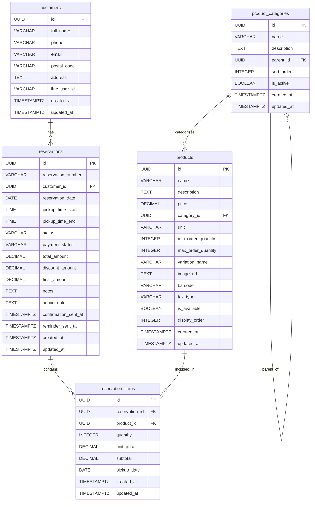

# 🔧 保育園・種苗店予約システム 技術仕様書 v2.0

## 📋 概要

本書は保育園・種苗店予約システムの技術的実装詳細について記述したものです。開発者向けの詳細な技術情報を提供します。

## 🏗️ アーキテクチャ概要

### システム構成図
```
┌─────────────────┐    ┌─────────────────┐    ┌─────────────────┐
│   Frontend      │    │   Backend       │    │   Database      │
│   (Next.js)     │◄──►│   (Supabase)    │◄──►│  (PostgreSQL)   │
│                 │    │                 │    │                 │
│ - React         │    │ - Auth          │    │ - 16 Tables     │
│ - TypeScript    │    │ - Edge Func     │    │ - RLS           │
│ - Tailwind      │    │ - Storage       │    │ - Indexes       │
└─────────────────┘    └─────────────────┘    └─────────────────┘
         │                       │
         ▼                       ▼
┌─────────────────┐    ┌─────────────────┐
│  LINE Platform  │    │   Vercel        │
│                 │    │                 │
│ - Messaging API │    │ - Hosting       │
│ - Login API     │    │ - CI/CD         │
│ - LIFF          │    │ - Edge Network  │
└─────────────────┘    └─────────────────┘
```

## 🗄️ データベース設計詳細

### ER図


### インデックス戦略

#### パフォーマンス重視インデックス
```sql
-- 頻繁な検索用
CREATE INDEX idx_reservations_date             ON reservations(reservation_date);
CREATE INDEX idx_reservations_status           ON reservations(status);
CREATE INDEX idx_reservations_customer         ON reservations(customer_id);
CREATE INDEX idx_customers_phone               ON customers(phone);
CREATE INDEX idx_customers_line_user_id        ON customers(line_user_id);
CREATE INDEX idx_products_category             ON products(category_id);
CREATE INDEX idx_products_available            ON products(is_available);
CREATE INDEX idx_reservation_items_reservation ON reservation_items(reservation_id);
CREATE INDEX idx_reservation_items_product     ON reservation_items(product_id);

-- 複合インデックス
CREATE INDEX idx_reservations_date_status ON reservations(reservation_date, status);
CREATE INDEX idx_products_category_available ON products(category_id, is_available);

-- 部分インデックス
CREATE INDEX idx_active_products ON products(name) WHERE is_available = true;
CREATE INDEX idx_pending_reservations ON reservations(created_at) WHERE status = 'pending';
```

### Row Level Security (RLS) 設定

#### customers テーブル
```sql
-- 顧客は自分の情報のみアクセス可能
CREATE POLICY "customers_own_data" ON customers
    FOR ALL USING (
        auth.uid()::text = line_user_id OR
        auth.role() = 'authenticated'
    );

-- 管理者は全てアクセス可能
CREATE POLICY "admin_full_access" ON customers
    FOR ALL USING (
        EXISTS (
            SELECT 1 FROM user_profiles 
            WHERE user_id = auth.uid() 
            AND role IN ('admin', 'manager')
        )
    );
```

#### products テーブル
```sql
-- 商品は全員閲覧可能（利用可能商品のみ）
CREATE POLICY "products_read_all" ON products
    FOR SELECT USING (is_available = true);

-- 管理者のみ編集可能
CREATE POLICY "products_admin_only" ON products
    FOR ALL USING (
        EXISTS (
            SELECT 1 FROM user_profiles 
            WHERE user_id = auth.uid() 
            AND role IN ('admin', 'manager')
        )
    );
```

## 🔧 API設計

### RESTful API エンドポイント

#### 認証関連
```typescript
// 認証状態確認
GET /api/auth/me
Response: {
  user: User | null,
  profile: UserProfile | null
}

// ログアウト
POST /api/auth/logout
Response: { success: boolean }
```

#### 顧客管理
```typescript
// 顧客情報取得
GET /api/customers/:id
Response: {
  data: Customer,
  success: boolean
}

// 顧客情報更新
PUT /api/customers/:id
Body: Partial<Customer>
Response: {
  data: Customer,
  success: boolean
}
```

#### 商品管理
```typescript
// 商品一覧取得
GET /api/products?category=:categoryId&page=:page&limit=:limit
Response: {
  data: Product[],
  pagination: {
    total: number,
    page: number,
    limit: number,
    totalPages: number
  }
}

// 商品詳細取得
GET /api/products/:id
Response: {
  data: Product & { category: ProductCategory },
  success: boolean
}
```

#### 予約管理
```typescript
// 予約作成
POST /api/reservations
Body: {
  customer_id: string,
  reservation_date: string,
  pickup_time_start: string,
  pickup_time_end: string,
  items: ReservationItemInput[]
}
Response: {
  data: Reservation,
  success: boolean
}

// 予約一覧取得（管理者用）
GET /api/admin/reservations?status=:status&date=:date
Response: {
  data: (Reservation & { customer: Customer, items: ReservationItem[] })[],
  stats: ReservationStats
}
```

### Supabase Edge Functions

#### 自動通知機能
```typescript
// functions/send-notification/index.ts
import { serve } from "https://deno.land/std@0.168.0/http/server.ts"
import { createClient } from 'https://esm.sh/@supabase/supabase-js@2'

serve(async (req) => {
  const { type, reservation_id, customer_id } = await req.json()
  
  // 顧客情報取得
  const customer = await getCustomer(customer_id)
  
  // 通知送信
  switch (type) {
    case 'confirmation':
      await sendConfirmationMessage(customer, reservation_id)
      break
    case 'reminder':
      await sendReminderMessage(customer, reservation_id)
      break
    case 'ready':
      await sendReadyNotification(customer, reservation_id)
      break
  }
  
  return new Response(JSON.stringify({ success: true }))
})
```

#### データ分析機能
```typescript
// functions/analytics/index.ts
serve(async (req) => {
  const { type, period } = await req.json()
  
  const analytics = await generateAnalytics(type, period)
  
  return new Response(JSON.stringify({
    data: analytics,
    generated_at: new Date().toISOString()
  }))
})

interface AnalyticsData {
  reservations: {
    total: number
    by_status: Record<string, number>
    by_date: Array<{ date: string, count: number }>
  }
  revenue: {
    total: number
    by_period: Array<{ period: string, amount: number }>
  }
  customers: {
    total: number
    new_customers: number
    repeat_customers: number
  }
}
```

## 🎨 フロントエンド設計

### コンポーネント構成

#### ディレクトリ構造
```
app/
├── components/
│   ├── common/           # 共通コンポーネント
│   │   ├── Header.tsx
│   │   ├── Footer.tsx
│   │   ├── LoadingSpinner.tsx
│   │   └── ConfirmDialog.tsx
│   ├── forms/            # フォーム関連
│   │   ├── CustomerInfoForm.tsx
│   │   ├── ProductSelectionForm.tsx
│   │   └── ReservationFormTemplate.tsx
│   ├── admin/            # 管理画面
│   │   ├── AdminLayout.tsx
│   │   ├── ProductManagement.tsx
│   │   ├── ReservationList.tsx
│   │   └── CustomerManagement.tsx
│   └── ui/               # UIコンポーネント
│       ├── Button.tsx
│       ├── Input.tsx
│       ├── Modal.tsx
│       └── Table.tsx
├── lib/                  # ユーティリティ
│   ├── supabase.ts
│   ├── auth.ts
│   ├── utils.ts
│   └── constants.ts
├── services/             # ビジネスロジック
│   ├── ProductService.ts
│   ├── ReservationService.ts
│   ├── CustomerService.ts
│   └── NotificationService.ts
└── types/                # 型定義
    ├── database.ts
    ├── forms.ts
    └── api.ts
```

#### 状態管理
```typescript
// Zustand使用例
import { create } from 'zustand'

interface ReservationStore {
  currentReservation: Partial<Reservation> | null
  selectedProducts: Product[]
  customerInfo: Partial<Customer> | null
  
  // Actions
  setCurrentReservation: (reservation: Partial<Reservation>) => void
  addProduct: (product: Product, quantity: number) => void
  removeProduct: (productId: string) => void
  updateCustomerInfo: (info: Partial<Customer>) => void
  clearReservation: () => void
}

export const useReservationStore = create<ReservationStore>((set) => ({
  currentReservation: null,
  selectedProducts: [],
  customerInfo: null,
  
  setCurrentReservation: (reservation) => 
    set({ currentReservation: reservation }),
  
  addProduct: (product, quantity) => 
    set((state) => ({
      selectedProducts: [
        ...state.selectedProducts.filter(p => p.id !== product.id),
        { ...product, quantity }
      ]
    })),
  
  removeProduct: (productId) => 
    set((state) => ({
      selectedProducts: state.selectedProducts.filter(p => p.id !== productId)
    })),
  
  updateCustomerInfo: (info) => 
    set((state) => ({
      customerInfo: { ...state.customerInfo, ...info }
    })),
  
  clearReservation: () => 
    set({
      currentReservation: null,
      selectedProducts: [],
      customerInfo: null
    })
}))
```

### フォームバリデーション

#### React Hook Form + Zod
```typescript
import { z } from 'zod'
import { useForm } from 'react-hook-form'
import { zodResolver } from '@hookform/resolvers/zod'

// バリデーションスキーマ
const customerSchema = z.object({
  full_name: z.string()
    .min(1, '氏名は必須です')
    .max(100, '氏名は100文字以内で入力してください'),
  
  phone: z.string()
    .regex(/^0\d{9,10}$/, '正しい電話番号を入力してください'),
  
  email: z.string()
    .email('正しいメールアドレスを入力してください')
    .optional()
    .or(z.literal('')),
  
  postal_code: z.string()
    .regex(/^\d{3}-?\d{4}$/, '正しい郵便番号を入力してください')
    .optional()
    .or(z.literal('')),
  
  address: z.string()
    .max(500, '住所は500文字以内で入力してください')
    .optional()
    .or(z.literal(''))
})

type CustomerFormData = z.infer<typeof customerSchema>

// フォームコンポーネント
export const CustomerInfoForm = ({ onSubmit }: { onSubmit: (data: CustomerFormData) => void }) => {
  const {
    register,
    handleSubmit,
    formState: { errors, isSubmitting }
  } = useForm<CustomerFormData>({
    resolver: zodResolver(customerSchema)
  })
  
  return (
    <form onSubmit={handleSubmit(onSubmit)}>
      <div>
        <label>氏名 *</label>
        <input {...register('full_name')} />
        {errors.full_name && (
          <span className="error">{errors.full_name.message}</span>
        )}
      </div>
      
      <div>
        <label>電話番号 *</label>
        <input {...register('phone')} type="tel" />
        {errors.phone && (
          <span className="error">{errors.phone.message}</span>
        )}
      </div>
      
      <button type="submit" disabled={isSubmitting}>
        {isSubmitting ? '送信中...' : '送信'}
      </button>
    </form>
  )
}
```

## 🔐 セキュリティ実装

### 認証フロー

#### LINE Login実装
```typescript
// lib/line-auth.ts
import { supabase } from './supabase'

export class LineAuthService {
  static async authenticateWithLIFF(): Promise<AuthResult> {
    try {
      // LIFF初期化
      await liff.init({ liffId: process.env.NEXT_PUBLIC_LIFF_ID! })
      
      if (!liff.isLoggedIn()) {
        liff.login()
        return { success: false, error: 'Login required' }
      }
      
      // LINEプロフィール取得
      const profile = await liff.getProfile()
      const idToken = liff.getIDToken()
      
      // Supabaseカスタム認証
      const { data, error } = await supabase.auth.signInWithIdToken({
        provider: 'line',
        token: idToken
      })
      
      if (error) throw error
      
      // 顧客情報の作成/更新
      await this.upsertCustomer(profile, data.user)
      
      return { success: true, user: data.user, profile }
      
    } catch (error) {
      console.error('LINE認証エラー:', error)
      return { success: false, error: error.message }
    }
  }
  
  private static async upsertCustomer(
    lineProfile: LineProfile,
    user: User
  ): Promise<Customer> {
    const { data, error } = await supabase
      .from('customers')
      .upsert({
        line_user_id: lineProfile.userId,
        full_name: lineProfile.displayName,
        email: user.email
      }, {
        onConflict: 'line_user_id',
        ignoreDuplicates: false
      })
      .select()
      .single()
    
    if (error) throw error
    return data
  }
}
```

#### JWT検証
```typescript
// middleware.ts
import { createMiddlewareClient } from '@supabase/auth-helpers-nextjs'
import { NextResponse } from 'next/server'
import type { NextRequest } from 'next/server'

export async function middleware(req: NextRequest) {
  const res = NextResponse.next()
  const supabase = createMiddlewareClient({ req, res })
  
  // セッション確認
  const {
    data: { session },
  } = await supabase.auth.getSession()
  
  // 管理画面アクセス制御
  if (req.nextUrl.pathname.startsWith('/admin')) {
    if (!session) {
      return NextResponse.redirect(new URL('/login', req.url))
    }
    
    // 管理者権限確認
    const { data: profile } = await supabase
      .from('user_profiles')
      .select('role')
      .eq('user_id', session.user.id)
      .single()
    
    if (!profile || !['admin', 'manager'].includes(profile.role)) {
      return NextResponse.redirect(new URL('/unauthorized', req.url))
    }
  }
  
  return res
}

export const config = {
  matcher: ['/admin/:path*', '/api/admin/:path*']
}
```

### データ暗号化

#### 機密データハンドリング
```typescript
// lib/encryption.ts
import crypto from 'crypto'

const ENCRYPTION_KEY = process.env.ENCRYPTION_KEY!
const ALGORITHM = 'aes-256-gcm'

export class EncryptionService {
  static encrypt(text: string): string {
    const iv = crypto.randomBytes(16)
    const cipher = crypto.createCipher(ALGORITHM, ENCRYPTION_KEY)
    cipher.setAAD(Buffer.from('additional-data'))
    
    let encrypted = cipher.update(text, 'utf8', 'hex')
    encrypted += cipher.final('hex')
    
    const authTag = cipher.getAuthTag()
    
    return `${iv.toString('hex')}:${authTag.toString('hex')}:${encrypted}`
  }
  
  static decrypt(encryptedData: string): string {
    const [ivHex, authTagHex, encrypted] = encryptedData.split(':')
    
    const iv = Buffer.from(ivHex, 'hex')
    const authTag = Buffer.from(authTagHex, 'hex')
    
    const decipher = crypto.createDecipher(ALGORITHM, ENCRYPTION_KEY)
    decipher.setAAD(Buffer.from('additional-data'))
    decipher.setAuthTag(authTag)
    
    let decrypted = decipher.update(encrypted, 'hex', 'utf8')
    decrypted += decipher.final('utf8')
    
    return decrypted
  }
}

// 使用例：機密データ保存時
const encryptedPhone = EncryptionService.encrypt(phoneNumber)
await supabase.from('customers').insert({
  ...customerData,
  phone: encryptedPhone
})
```

## 📱 LINE連携実装

### LIFF アプリケーション設定

#### LIFF初期化
```typescript
// lib/liff.ts
declare global {
  interface Window {
    liff: any
  }
}

export class LIFFService {
  private static initialized = false
  
  static async initialize(): Promise<boolean> {
    if (this.initialized) return true
    
    try {
      await window.liff.init({
        liffId: process.env.NEXT_PUBLIC_LIFF_ID!
      })
      
      this.initialized = true
      return true
      
    } catch (error) {
      console.error('LIFF初期化エラー:', error)
      return false
    }
  }
  
  static isLoggedIn(): boolean {
    return this.initialized && window.liff.isLoggedIn()
  }
  
  static async getProfile(): Promise<LineProfile | null> {
    if (!this.isLoggedIn()) return null
    
    try {
      return await window.liff.getProfile()
    } catch (error) {
      console.error('プロフィール取得エラー:', error)
      return null
    }
  }
  
  static login(): void {
    if (this.initialized) {
      window.liff.login()
    }
  }
  
  static logout(): void {
    if (this.initialized) {
      window.liff.logout()
    }
  }
  
  static closeWindow(): void {
    if (this.initialized && window.liff.isInClient()) {
      window.liff.closeWindow()
    }
  }
  
  static async shareTargetPicker(message: any): Promise<void> {
    if (this.initialized && window.liff.isApiAvailable('shareTargetPicker')) {
      await window.liff.shareTargetPicker(message)
    }
  }
}
```

### Messaging API実装

#### 自動通知システム
```typescript
// services/LineMessagingService.ts
import { Client, FlexMessage, TextMessage } from '@line/bot-sdk'

export class LineMessagingService {
  private client: Client
  
  constructor() {
    this.client = new Client({
      channelAccessToken: process.env.LINE_CHANNEL_ACCESS_TOKEN!,
      channelSecret: process.env.LINE_CHANNEL_SECRET!
    })
  }
  
  // 予約確認メッセージ
  async sendReservationConfirmation(
    lineUserId: string,
    reservation: Reservation,
    items: ReservationItem[]
  ): Promise<boolean> {
    try {
      const message = this.createReservationConfirmationMessage(reservation, items)
      
      await this.client.pushMessage(lineUserId, message)
      
      // 送信ログ記録
      await this.logMessage(lineUserId, 'confirmation', message)
      
      return true
      
    } catch (error) {
      console.error('LINE送信エラー:', error)
      return false
    }
  }
  
  // 受取準備完了通知
  async sendReadyNotification(
    lineUserId: string,
    reservation: Reservation
  ): Promise<boolean> {
    const message: FlexMessage = {
      type: 'flex',
      altText: 'ご注文の商品の準備が完了しました',
      contents: {
        type: 'bubble',
        header: {
          type: 'box',
          layout: 'vertical',
          contents: [
            {
              type: 'text',
              text: '商品準備完了🌱',
              weight: 'bold',
              size: 'lg',
              color: '#2ecc71'
            }
          ]
        },
        body: {
          type: 'box',
          layout: 'vertical',
          contents: [
            {
              type: 'text',
              text: `予約番号: ${reservation.reservation_number}`,
              size: 'md',
              weight: 'bold'
            },
            {
              type: 'text',
              text: `受取予定: ${reservation.reservation_date}`,
              size: 'sm',
              color: '#666666'
            },
            {
              type: 'text',
              text: 'ご注文いただいた商品の準備が完了いたしました。指定のお時間にお越しください。',
              wrap: true,
              margin: 'md'
            }
          ]
        },
        footer: {
          type: 'box',
          layout: 'vertical',
          contents: [
            {
              type: 'button',
              action: {
                type: 'uri',
                label: '予約詳細を確認',
                uri: `${process.env.NEXT_PUBLIC_BASE_URL}/reservations/${reservation.id}`
              },
              style: 'primary'
            }
          ]
        }
      }
    }
    
    return await this.sendMessage(lineUserId, message, 'ready')
  }
  
  private async sendMessage(
    lineUserId: string,
    message: any,
    type: string
  ): Promise<boolean> {
    try {
      await this.client.pushMessage(lineUserId, message)
      await this.logMessage(lineUserId, type, message)
      return true
    } catch (error) {
      console.error('LINE送信エラー:', error)
      return false
    }
  }
  
  private async logMessage(
    lineUserId: string,
    type: string,
    message: any
  ): Promise<void> {
    await supabase.from('line_message_logs').insert({
      line_user_id: lineUserId,
      message_type: type,
      message_content: message,
      sent_at: new Date().toISOString()
    })
  }
}
```

## 🚀 デプロイメント

### Vercel設定

#### vercel.json
```json
{
  "framework": "nextjs",
  "buildCommand": "npm run build",
  "devCommand": "npm run dev",
  "installCommand": "npm install",
  "functions": {
    "app/api/**/*.ts": {
      "maxDuration": 30
    }
  },
  "env": {
    "NEXT_PUBLIC_SUPABASE_URL": "@supabase-url",
    "NEXT_PUBLIC_SUPABASE_ANON_KEY": "@supabase-anon-key",
    "NEXT_PUBLIC_LIFF_ID": "@liff-id",
    "LINE_CHANNEL_ACCESS_TOKEN": "@line-access-token",
    "LINE_CHANNEL_SECRET": "@line-channel-secret"
  },
  "headers": [
    {
      "source": "/api/(.*)",
      "headers": [
        {
          "key": "Access-Control-Allow-Origin",
          "value": "*"
        },
        {
          "key": "Access-Control-Allow-Methods",
          "value": "GET, POST, PUT, DELETE, OPTIONS"
        },
        {
          "key": "Access-Control-Allow-Headers",
          "value": "X-Requested-With, Content-Type, Authorization"
        }
      ]
    }
  ]
}
```

### CI/CD パイプライン

#### GitHub Actions
```yaml
# .github/workflows/deploy.yml
name: Deploy to Vercel

on:
  push:
    branches: [main]
  pull_request:
    branches: [main]

jobs:
  test:
    runs-on: ubuntu-latest
    steps:
      - uses: actions/checkout@v3
      
      - name: Setup Node.js
        uses: actions/setup-node@v3
        with:
          node-version: '18'
          cache: 'npm'
      
      - name: Install dependencies
        run: npm ci
      
      - name: Run tests
        run: npm run test
      
      - name: Run linting
        run: npm run lint
      
      - name: Type check
        run: npm run type-check
      
      - name: Build application
        run: npm run build

  deploy:
    needs: test
    runs-on: ubuntu-latest
    if: github.ref == 'refs/heads/main'
    
    steps:
      - uses: actions/checkout@v3
      
      - name: Deploy to Vercel
        uses: amondnet/vercel-action@v20
        with:
          vercel-token: ${{ secrets.VERCEL_TOKEN }}
          vercel-org-id: ${{ secrets.ORG_ID }}
          vercel-project-id: ${{ secrets.PROJECT_ID }}
          vercel-args: '--prod'
```

## 📊 監視・ログ

### エラーハンドリング

#### 包括的エラー処理
```typescript
// lib/error-handler.ts
export class AppError extends Error {
  constructor(
    message: string,
    public code: string,
    public statusCode: number = 500,
    public details?: any
  ) {
    super(message)
    this.name = 'AppError'
  }
}

export class ErrorHandler {
  static handle(error: unknown): { message: string; code: string; statusCode: number } {
    if (error instanceof AppError) {
      return {
        message: error.message,
        code: error.code,
        statusCode: error.statusCode
      }
    }
    
    if (error instanceof Error) {
      return {
        message: 'システムエラーが発生しました',
        code: 'INTERNAL_ERROR',
        statusCode: 500
      }
    }
    
    return {
      message: '不明なエラーが発生しました',
      code: 'UNKNOWN_ERROR',
      statusCode: 500
    }
  }
  
  static async log(error: unknown, context?: any): Promise<void> {
    const errorInfo = this.handle(error)
    
    // Supabaseログテーブルに記録
    await supabase.from('error_logs').insert({
      message: errorInfo.message,
      code: errorInfo.code,
      status_code: errorInfo.statusCode,
      context: context,
      stack: error instanceof Error ? error.stack : null,
      timestamp: new Date().toISOString()
    })
    
    // 重要なエラーはSlack通知
    if (errorInfo.statusCode >= 500) {
      await this.notifySlack(errorInfo, context)
    }
  }
  
  private static async notifySlack(
    error: { message: string; code: string },
    context?: any
  ): Promise<void> {
    // Slack通知実装
    console.error('Critical Error:', error, context)
  }
}
```

### パフォーマンス監視

#### メトリクス収集
```typescript
// lib/metrics.ts
export class MetricsCollector {
  static async trackPageView(page: string, userId?: string): Promise<void> {
    await supabase.from('page_views').insert({
      page,
      user_id: userId,
      timestamp: new Date().toISOString(),
      user_agent: navigator.userAgent
    })
  }
  
  static async trackApiCall(
    endpoint: string,
    method: string,
    responseTime: number,
    statusCode: number
  ): Promise<void> {
    await supabase.from('api_metrics').insert({
      endpoint,
      method,
      response_time: responseTime,
      status_code: statusCode,
      timestamp: new Date().toISOString()
    })
  }
  
  static async trackReservationFlow(
    step: string,
    sessionId: string,
    duration?: number
  ): Promise<void> {
    await supabase.from('reservation_flow_metrics').insert({
      step,
      session_id: sessionId,
      duration,
      timestamp: new Date().toISOString()
    })
  }
}

// API呼び出し時の使用例
const startTime = Date.now()
try {
  const result = await apiCall()
  MetricsCollector.trackApiCall('/api/reservations', 'POST', Date.now() - startTime, 200)
  return result
} catch (error) {
  MetricsCollector.trackApiCall('/api/reservations', 'POST', Date.now() - startTime, 500)
  throw error
}
```

---

**作成日**: 2025年7月19日  
**バージョン**: 2.0  
**最終更新**: 2025年7月19日  
**対象システム**: 保育園・種苗店予約システム